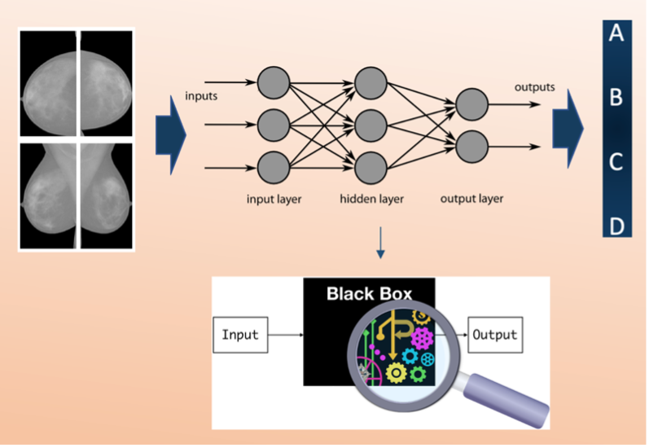

# MLINFN-CNNBreastDensityClassifier-Explainability
## Explainability of a Convolutional Neural Network classifier for breast density assessment

### Software and tools

| Programming Language | ML Toolset | Additional libraries |
| -------------- | -------------- | -------------- |
| Python | Keras, Tensorflow | sklearn, pandas, OpenCv |

### Needed dataset

| Data Type |
| ------------ | 
| Preprocessed Mammographic Images |

### Short Description of the Use Case

In this tutorial we train a **deep Residual Convolutional Neural Network** classifier, able to automatically classify mammographic images into breast density classes, from scratch. We test it, we compute the figures of merit to evaluate the performance and finally, we obtain the Class Activation Maps through the Grad-CAM technique to explain the behaviour of the deep neural network. 
Deep neural network explainability is a critical issue in Artificial Intelligence (AI), as a deep network is a sort of black box. In this use case, we develop a method to explain the behaviour of the deep classifier by visualizing, through the activation maps, what the model learns.

A full explanation of this use case is available at the following [link](https://confluence.infn.it/display/MLINFN/Explainability+of+a+CNN+classifier+for+breast+density+assessment).

### How to execute the example in this GitHub repo

You need Jupyter notebook as well as all the Python packages necessary to run it.

In the folder “*myproject*” you can find all the useful scripts.

1) The python scripts *.py* to train and test the CNN requires as hardware:

    CPUs: 2x 10 cores Intel Xeon E5-2640v4 @2.40 GHz
    RAM: 64 GB
    GPUs: 8x nVidia Tesla K80, with 2x GPUs Tesla GK210, 24 GB RAM and 2496 CUDA cores each

The training requires about 24h to be completed.

2) The scripts in Jupiter notebooks can be run on Google CoLab or you can clone the GitHub repo and execute the notebook locally.

### Annotated Description

1. _**Train__ResNet.py**_:  this is the first script to execute if you want to train the CNN ResNet model from scratch. You may train the network four times, one per projection. You can use your own dataset as training set. It should consist of at least about 1000 images and it should be divided in 4 different folders  (*CC_R, CC_L, MLO_L, MLO_R*) and each folder divided into 4 sub-folders, one per class (A, B, C, D). In "*CC_R_model*" directory we saved the output of a training as an example.
2. _**Prediction__ResNet.py**_: this is the script to test the saved trained model on new images.  It is suggested to use your own test set also for testing. The test set of images should be organized in folders as the training set. If you don't have enough images to train the model but you just want to test it, you can use a pre-trained model ('*weights-improvement-46-0.80.h5*') saved in the folder "*CC_R_model*".
3. _**Figure__merit.ipynb**_: this is the script to obtain the metrics, the final figures of merit to evaluate the classification performance on the test set. You need as input the *.txt* files, obtained with the script "*Prediction_ResNet.py*" and containing the prediction outcomes. We uploaded "*predictions_mlor.txt, predictions_ccr.txt, predictions_mlol.txt, predictions_ccl.txt*" files in folder "*Prediction*", obtained from a pre-trained and tested ResNet model to use them as examples.
4. _**ClassActivationMaps.ipynb**_: this is the script to obtain the Class Activation Maps based on the Grad-CAM technique. You can use the test images we uploaded as example in the folder “*TestSet*”, they are just one image per class for each projection. You can use them and the pre-trained model in the folder "*CC_R_model*" to try the script as tutorial  the first time. Then, you can execute the script on your own larger dataset and on your trained model to obtain the maps in your specific case.

